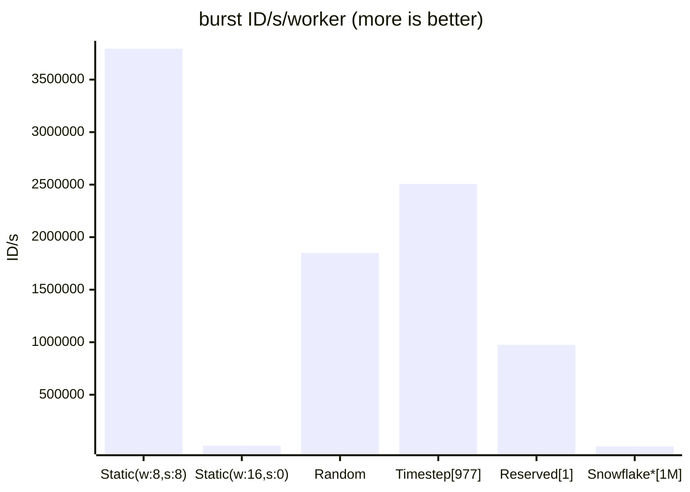

[](https://github.com/pvmlibs/flexid/actions)
[](https://codecov.io/gh/pvmlibs/flexid/branch/master)

# Distributed ID generator for PHP

High performance, distributed 64-bit integer ID generator. Features:
- Generate unique ID on one or multiple nodes/processes. Workers management included for efficient ID pool usage
- Encode integer ID for shorter strings/obfuscate integer ID with custom alphabet e.g. xzRYLSKxJH
- Encrypt integer ID when need extra security, also produces shorter string e.g. mXjZKfmfXzwPw
- ID lifespan ranges from 292 to 292271 years
- up to 1048576 workers
- customizable generators for many different workflows

## Requirements

Core functionality doesn't require any extensions and dependencies, required are only:

1. 64-bit system
2. PHP >= 8.1

For Redis worker resolvers:
1. predis package or phpredis extension (preferred for performance).

For serializing encrypted ID with custom length alphabet:
1. bcmath extension. You still can serialize encrypted ID without it.

## Installation

```shell
composer require pvmlibs/flexid
```

## ID structure

ID uses 63 bits (sign bit is not used). There are 4 groups of bits:


ID lifespan range varies from 292 (default) to 292271 years, depending on timestamp bitshift config. Each group bits
count can vary with assumption that the sum of workers, sequence, groups bits and timestamp bitshift value must be <= 30.
Bits configuration and timestamp bitshift directly affects theoretic throughput, timestamp bitshift also defines max ID
lifespan. For more read [ID structure](docs/IdStructure.md)

## Implementation

1. Worker resolver - manages and provide worker id and ID configuration. For more read [Resolvers](docs/Resolvers.md)
   - RedisTimestepWorkerResolver, allows ID uniqueness, needs Redis/Valkey, most universal
   - RedisReservedWorkerResolver, allows ID uniqueness, needs Redis/Valkey, best for long processes
   - StaticWorkerResolver, allows ID uniqueness when provided explicit unique worker ID
   - RandomWorkerResolver, allows ID uniqueness within one process
   - ApcuTimestepWorkerResolver, allows ID uniqueness within group of processes sharing the same APCu
2. Generator - generates ID using resolver. Manages requesting workers and creates sequence with group part.
   Generator should be used as singleton in application for performance and to assure proper time monotonicity. You can
   also define a fallback to other generator if it can't resolve worker id.
3. Encoders - encodes ID to string/decodes from int using provided alphabet. The default alphabet is stripped from common
   vowels to prevent forming random words
   - MonotonicEncoder - encoded ID are still monotonical but with alphabet, so sequential ID are similar
   - PseudoRandomEncoder - encoded ID seems random even for sequential ID, uses more obfuscation than MonotonicEncoder
4. Encryptors - encrypts/decrypts ID. It also uses internal switchable encoder.
   - Sparx64Encrypter - uses Sparx ARX-based block cipher than can transform ID to other 64-bit number that looks
      completely random and prevent reading back ID without secret key. Encrypted ID have to use encoder for printable
      output:
     - NativeSerializer - supports only power of 2 alphabet lengths but don't require any php extensions
     - BCMathSerializer - supports any alphabet lengths but requires bcmath extensions

## Usage

IMPORTANT!
ID is part of application design, you need to evaluate what the application requirements are, like:
- how many nodes/processes are expected generate ID concurrently
- what throughput is needed (ID/s/worker)
- can ID be exposed to public? Raw ID don't expose DB records number as implicit as autoincrement ID but still they can
  disclose creation time along with information about worker id, sequence and group id. Light form of hiding ID is to
  use encoder or encrypter for more secure solution. Validate if performance of these solutions are acceptable.
- should ID be as short as possible? For that you can use e.g. timestamp bitshift 16 and encoder.
- how ID will be stored in DB? For DB performance the best is bigint type 

Parameters that should be constant through application lifetime to prevent ID overlapping:
- timestamp offset
- timestamp bitshift
- encoder parameters (if used) including used alphabet to be able to correctly decode once sent encoded ID
- encrypter parameters (if used) including used alphabet to be able to correctly decrypt once sent encrypted ID

Other parameters like worker bits, sequence bits, group bits are pretty safe to manipulate in future - collision can 
happen only within the same timestep (max 1,07s). If you want to change/have generators with different worker bits and
sequence bits working concurrently then set common group bits and assign each generator type own group id.  

You can look at [ID overview](docs/IdOverview.md) to get some idea what to expect.

Some general guidance:

1. Use generator as singleton in application for performance and uniqueness guarantee (in StaticWorkerResolver and
   RandomWorkerResolver), unless you want to have generators with different configuration.
2. When sending to JavaScript you need to cast id to string (JS does not handle 64-bit int) or use encoder for that.

Generate ID:
```php
// just generate some unique ID
$generator = new \Pvmlibs\FlexId\FlexIdGenerator(
    workerResolver: new \Pvmlibs\FlexId\Resolvers\RedisTimestepWorkerResolver(client: $redisClient)
);

$generator->id(); // 43526598068356096

// static worker id, uses process PID as worker id as example
$generator = new \Pvmlibs\FlexId\(
                workerResolver: new \Pvmlibs\FlexId\Resolvers\StaticWorkerResolver(
                    workerHandlerFn: fn () => getmypid(), workersBits: 8, sequenceBits: 8
                )
            );
$generator->id(); // 43524358613175296
```

Generate many ID more efficiently:
```php
$ids = $generator->bulkIds(1000); // array
```

Generate ID with encoding. Encoders can be also used to encode/decode any integer number:
```php
$generator = new \Pvmlibs\FlexId\FlexIdGenerator(
    workerResolver: new \Pvmlibs\FlexId\Resolvers\RedisTimestepWorkerResolver(client: $redisClient)
);
$encoder = new \Pvmlibs\FlexId\Encoders\PseudoRandomEncoder();

// using helper container
$encodedId = new \Pvmlibs\FlexId\EncodedId(
   flexIdGenerator: $generator,
   encoder: $encoder,
);

$id = $encodedId->generateId(); // 43581127276918784
$publicId = $encodedId->toPublicId($id); // sNy4hCLr4V
$encodedId->fromPublicId($publicId); // 43581127276918784

// or use encoder directly
$id = $generator->id(); // 43581127276918784
$publicId = $encoder->encode($id); // sNy4hCLr4V
$encoder->decode($publicId); // 43581127276918784
```

Generate ID with encrypting. Encryptor can be also used to encrypt/decrypt any integer number:
```php
$generator = new \Pvmlibs\FlexId\FlexIdGenerator(
    workerResolver: new \Pvmlibs\FlexId\Resolvers\RedisTimestepWorkerResolver(client: $redisClient)
);
$secret = \Pvmlibs\FlexId\Encrypters\Sparx64Encrypter::generateSecret();
$encrypter = new \Pvmlibs\FlexId\Encrypters\Sparx64Encrypter(
    secret: $secret,
    serializer: new \Pvmlibs\FlexId\Encrypters\Serializers\NativeSerializer()
);

// using helper container
$encryptedId = new \Pvmlibs\FlexId\EncryptedId(
    flexIdGenerator: $generator,
    encrypter: $encrypter,
);

$id = $encryptedId->generateId(); // 43581127276918784
$publicId = $encryptedId->toPublicId($id); // yVyKqbkQDgYgR
$encryptedId->fromPublicId($publicId); // 43581127276918784

// or use encoder directly
$id = $generator->id(); // 43581127276918784
$publicId = $encrypter->encrypt($id); // yVyKqbkQDgYgR
$encrypter->decrypt($publicId); // 43581127276918784
```
Backfill ID using Unix timestamp in microseconds. Make sure max sequence is enough for given timestep, sort timestamps
ascending or descending to prevent duplicates:
```php
$generator->idInTime(1779275145863184)) // 43585545820962816
```

Check performance, ID distribution in time, throughput with different timestamp bitshift and generator info:
```bash
php vendor/pvmlibs/flexid/bench.php [--dist --info]
```

You can also use class IdStats passing your configured generator to get results for this configuration.

## Tweaking

All classes are preconfigured, but you may want to tweak some parameters, especially if you have very large application
with very intensive ID generation, then you can make some other optimizations:

1. adjust metadata bits to more reflect your environment characteristics, e.g. need more workers but can use smaller
   sequence or can use fewer workers but need more performance in burst
2. separate generators and resolvers for short threads / long threads with different group id for uniqueness
3. adjust useNewWorkerOnSequenceOverflow. This flag increases ID generation rate when max sequence was reached in given
   timestep (but usually not benefits when below 16 bits of metadata) so we don't need to wait for next timestep at a
   cost of resolving new worker. This may be justified when e.g. only some of the workers will generate this many IDs,
   and it won't pose a threat on workers pool
4. with Redis based resolvers (especially RedisTimestepWorkerResolver), in large rate generation scenario (like > 1k/s
   with distinct generators) you may need to use dedicated database for generators to not affect performance of database
   for application.
5. Use phpredis redis extension instead of predis package for better performance (for Redis based resolvers)
6. Adjust timestampOffset in generator for max ID range - before using in production use and don't change it later. By
   default, it's Unix timestamp for 2025-01-01.
7. Use FlexIdGenerator->bulkIds() when applicable (see method description)
8. Sometimes there is 4x performance difference between php binaries (od Docker images)

## Performance

This implementation provide performance benefits especially when generating lots of IDs. Below are results from 1
generator generating 1M IDs in loop with id() method with different resolvers, 50us Redis round trip was applied.



\* Reference implementation of Snowflake with sequence handled by Redis for uniqueness - so 1 request for each ID.
W and S means workers bits and sequence bits accordingly. If not provided, the resolver defaults are used.
Number in square brackets means number of Redis requests. Timestep resolver by default uses $
useNewWorkerOnSequenceOverflow=true that's why number of Redis requests is much larger than in reserved resolver, but
still much less than in Snowflake implementation.

Keep in mind that performance in burst generation very depends on bit configuration.
