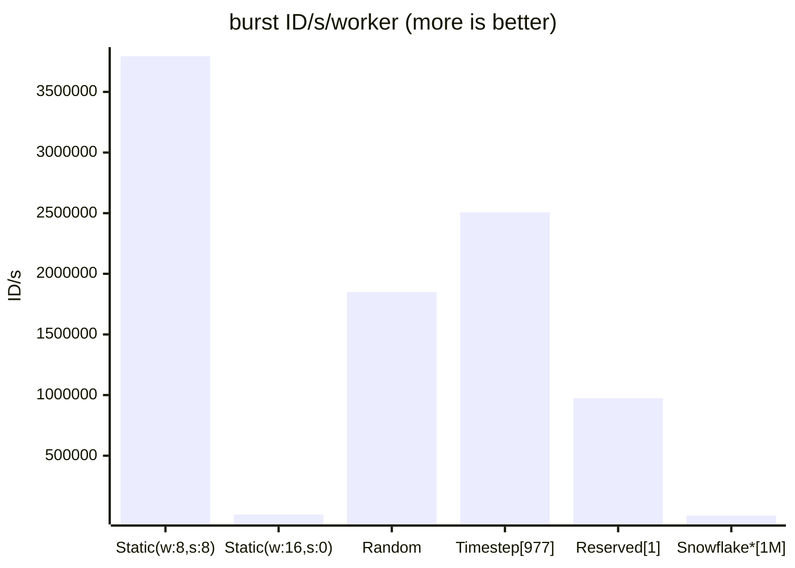

## FlexId generator

High performance, long range 64-bit integer ID generator. Generate millions of unique ID/s/worker with max ID range of
~ 292 years with simple usage.

## Background

There are already known distributed, unique integer ID algorithms, like:

- Snowflake: max 69 years lifespan, 10 bits for workers, 12 bits for sequence (per millisecond) - theoretic max
  throughput 4096000 id/s/worker
- Sonyflake: max 174 years lifespan, 16 bits for workers, 8 bits for sequence (per 10 milliseconds) - theoretic max
  throughput 25600 id/s/worker

So you can choose between lifespan or throughput/workers size. Main challenge with implementing such algorithms in
application is how to determine worker ID/sequence to provide ID uniqueness. For worker, this can be complicated as even
if we use e.g. part of machine IP and 16 bits, there can be still many threads on this host producing ID concurrently.
So usually in implementations, workers bits are filled randomly and some unique constraint is applied on sequence. But
this requires some central source of truth with every ID generation. This is especially costly on burst ID generation.

FlexId tries to mix long-range ID with performant ID generation, also in burst scenario.

## ID structure

ID uses 63 bits (sign bit is not used). There are 4 groups of bits:


ID range is constant ~ 292.25 years (2^63 / 1e9 seconds), regardless of bits configuration.

There are a few definitions:

1. metadata bits: workers, sequence and groups bits (max sum 28)
2. workers bits: defines maximum number of workers
3. sequence bits: defines maximum number of sequence
4. groups bits: defines logical groups e.g. datacenter, Redis server, distinct generator
5. timestep: a quantum of time defined by metadata bits count
6. timestamp: represents meaning bits for timestamp part, represents number of nanoseconds (when shifted left by
   metadata bits)

Metadata bits influence timestamp precision and also defines timestep - the amount of time the timestamp will increment.
The more metadata bits, the bigger timestep and lower timestamp resolution.
For example:

1. with 10 workers bits, 8 sequence bits, 0 groups bits the timestep is 2^18 ns = 262144 ns ~= 0,26 ms. That
   means 1024 workers can generate 256 IDs within 0.26 ms. Then theoretical throughput per worker is ~984615 id/s.
2. with 8 workers bits, 12 sequence bits, 0 groups bits the timestep is 2^20 ns = 1048576 ns ~= 1,048 ms. That
   means 256 workers can generate 4096 IDs within 1,048 ms. Then theoretical throughput per worker is ~3908396 id/s.

As you can see there are some tradeoffs between how many workers can generate how many IDs in quantum of time.
Groups bits are the last part of ID deliberately, this way you can mix different bits configuration needed for different
scenarios (e.g. small group of workers in burst mode and large group of processes with one time generation) and still
have unique guarantees, assuming only the same number of groups bits and different bits in that group between IDs.

Timestep can vary between 1-268435456 ns, (max ~268 ms), although with using microtime() resolution is up to 1000ns,
so it won't make sense using less than 10 bits of metadata. Constant ID range and small biggest timestep allow for
reconfiguration even when generators are already used in production - in other ID generation solutions usually once
setup, you need to stick to initial configuration.

## Implementation

There is two main concepts:

1. Resolver - provide worker id and ID configuration.
2. Generator - generates ID using resolver. Manages requesting workers and creates sequence part.
   Generator should be used as singleton in application for performance and to assure proper time monotonicity. You can
   also define a fallback to other generator if it can't resolve worker id.

Available resolvers:

1. RedisTimestepWorkerResolver - uses Redis/Valkey as central source of information about current worker within current
   timestep. It practically guarantees unique ID generation - unless clock time on hosts will skip outside margins
   defined in resolver ($timestepExpireSec). With properly working NTP services this shouldn't happen. The most
   universal resolver for unique ID and most efficient in terms of 1 Redis request, can handle large number of worker
   requests - with default settings it's ~1 million/sec but in reality it will be limited by Redis (for single DB I got
   ~115k/script eval/s). If you need large number of requests/sec (like single ID generating in multiple FPM processes)
   you can use multiple Redis servers and use groupsBits, e.g. 10 servers will need groupsBits 4 and then assign
   appropriate groupId or take a look at StaticWorkerResolver.
   Memory usage is 16 bytes * timestepExpireSec / timestep[sek].
   Use case: large number of threads concurrently generating ID, generating in short-lived processes
   Approx max performance with default settings: ~100k ID/s/DB single gen, ~100M ID/s/DB in burst (100k workers)
   Can provide unique ID: yes

2. RedisReservedWorkerResolver - uses Redis/Valkey as central source of information about workers pool. It practically
   guarantees unique ID generation - unless clock time on hosts will skip outside margins defined in resolver
   (minimalWorkerSeparationMs). By default, has lower tolerance for servers clocks drifts than
   RedisTimestepWorkerResolver. Overhead for single Redis request is ~40% bigger than in RedisTimestepWorkerResolver,
   but it's meant for long processes so it will only perform up to 1 request every 10 seconds (by default) so what we
   gain is lower Redis usage in high generation ratio scenarios than in RedisTimestepWorkerResolver. The best use case
   is for not too large (<~1000), long-running application workers with intensive ID generation. Memory usage is liner
   to workersBits (10 bits - 49kB). As a rule of thumb, keep max workers (represented with workerBits) twice as big as
   actual workers generating IDs due to time needed for separation after used worker.
   Use case: predictable number of worker threads with intensive ID generation, long-lived processes
   Approx max performance with default settings: ~1k ID/s/DB single gen, ~1000M ID/s/DB in burst (1k workers)
   Can provide unique ID: yes

3. RandomWorkerResolver - works without any external dependency and guarantees uniqueness but only within one thread
   generating ids at a time. For many parallel threads probability of collisions is proportional to id generation rate:
   ids/sec * timestep[sec] / max workers, so e.g. at 1k id/s with workersBits 11 = 1000 * 0,000002048 ÷ 2048 = 0.0001%
   so 0,001 collisions/s - 1 every ~16min with that constant generation rate. Note that timestep depends on total bits
   used (workerBits + sequenceBits + groupsBits). Increasing sequenceBits or groupsBits will decrease entropy.
   Increasing workerBits above 11 bits will not give more entropy as timestep will be also bigger. These 11 bits cover
   the smallest quantum of time on system, which should be ~1us.
   Entropy here is smaller about 4.2x than in Snowflake - we exchange that for ID range, thus if you care
   about as low collisions as possible and not for ID range - go with Snowflake. You can use pidBits (they are part of
   workerBits) when working in one host environment. These can provide ID uniqueness but only if pid of processes can
   fit in pidBits without repetition and there is one thread within process. With 11 workerBits, 8 pidBits is
   reasonable. In multihost environment better leave 0 pidBits.
   Use case: can't use Redis, small applications or medium if some collisions won't be a problem or as fallback for
   other generators.
   Can provide unique ID: generally no, but can under some conditions.

4. StaticWorkerResolver - when you can provide arbitrary worker id, you can use this class. Worker id should be returned
   from workerHandlerFn() function. For unique IDs you need to make sure worker id will fit into workersBits, is unique
   within all working processes, and you provide same worker id to the same host/container (check class description
   why). It's preconfigured for many workers - up to 65k. Keep in mind, the more metadata bits, the less performance in
   burst (except sequenceBits to some extent).
   Use case: you have own method of resolving worker ID in sane range (like < 65k) that will provide ID uniqueness.
   Can provide unique ID: yes if provided unique worker id for each concurrent generator/thread and keep
   worker/host/container - worker id pair.

All above resolvers are preconfigured for most common cases and should work performant out of the box, but you can
adjust bits for your needs. Check also code for the description of class parameters.
To save resources, generator will only request for worker on first ID generation.
The easiest way for unique ids is to go with some Redis based resolver.

## Tweaking

All classes are preconfigured, but you may want to tweak some parameters, especially if you have very large application
with very intensive ID generation, then you can make some other optimizations:

1. adjust metadata bits to more reflect your environment characteristics, e.g. need more workers but can use smaller
   sequence or can use fewer workers but need more performance in burst
2. separate generators and resolvers for short threads / long threads with different group id for uniqueness
3. adjust useNewWorkerOnSequenceOverflow. This flag increases ID generation rate when max sequence was reached in given
   timestep (but usually not benefits when below 16 bits of metadata) so we don't need to wait for next timestep at a
   cost of resolving new worker. This may be justified when e.g. only some of the workers will generate this many IDs
   and it won't pose a threat on workers pool
4. with Redis based resolvers (especially RedisTimestepWorkerResolver), in large rate generation scenario (like > 1k/s
   with distinct generators) you may need to use dedicated database for generators to not affect performance of database
   for application.
5. Use phpredis redis extension instead of predis package for better performance (for Redis based resolvers)
6. Adjust timestampOffset in generator for max ID range - before using in production use and don't change it later. By
   default, it's unix timestamp for 2025-01-01.
7. Use FlexIdGenerator->bulkIds() when applicable (see method description)

## Performance

This implementation provide performance benefits especially when generating lots of IDs. Below are results from 1
generator generating 1M IDs in loop with id() method with different resolvers, 50us Redis round trip was applied.



\* Reference implementation of Snowflake with sequence handled by Redis for uniqueness - so 1 request for each ID.
W and S means workers bits and sequence bits accordingly. If not provided, the resolver defaults are used.
Number in square brackets means number of Redis requests. Timestep resolver by default uses $
useNewWorkerOnSequenceOverflow=true that's why number of Redis requests is much larger than in reserved resolver, but
still much less than in Snowflake implementation.

Keep in mind that performance in burst generation very depends on bit configuration.

## FAQ

1. **Why application side ID?** Applications often wants to generate ID, especially in DDD or in architectures where
   there are multiple databases, often in different datacenters. So why not UUID? They are much simpler to create but
   some databases like MySql/MariaDB do not handle them efficiently (store as string). PostgreSQL stores them as 128-bit
   integer so much better, but still they are bigger so need more disk space and more index space. What about
   autoincrement then? That's a separate topic but the biggest issue can be with revealing some information such as
   rows count if publicly disclosed or possibility to enumerate. On the other hand timestamp based id reveals date of
   creation and are also possible to enumerate (in less extend but still) so that's up to you what you can accept.
2. **Why not Snowflake?** Snowflake is great, but sometimes can be not enough, especially when we want bigger ID life
   range. Although I've seen different implementations with the ones exceeding specification - totally custom bits with
   ID range more than 1000 years. We still need to stick to bits budget so we pay with lower count of independent
   generators or burst performance so such IDs are less universal. There is also problem with changing ID
   configuration - once set, the change will cause probable collisions in the future. So we need to be 100% sure what
   configuration choose by the time we design application. What if our assumptions will change in future? That's why
   FlexId uses fixed time range, in worst case with totally different configuration collision can appear within next ~
   0.27s from configuration change. Also, this implementation provides ready, out-of-the-box solution with worker
   resolvers, cooperating with ID generator for resource efficiency.
3. **I use Snowflake, can I migrate to FlexId?** Yes, you can. Use FlexIdGenerator::getOffsetFromSnowflakeId()
   method with your current id and provide time in future when you start generating new IDs. The method will return time
   offset you need to put in FlexIdGenerator. Max new time range will be ~292 - 4.2*(snowflake run years from time
   offset).
4. **How can I get info about system clock or remaining ID range?** You can use FlexIdGenerator->info() method.
5. **IDs sent to Javascript have small differences, why?** Javascript uses only 53 bits to represent numbers so 63 bits
   won't fit, and they are rounded to nearest value. You need to cast int to string when sending ID to Javascript.

## Requirements

1. 64-bit system
1. PHP >= 8.1
3. predis package or phpredis extension (preferred) if using Redis based resolvers.

## Installation

```shell
$ composer require pvmlibs/flexid
```

## Usage

Rules to remember:

1. Use generator as singleton in application for performance and uniqueness guarantee (in StaticWorkerResolver and
   RandomWorkerResolver)
2. When sending to javascript you need to cast id to string (js does not handle 64-bit int)

```php

// just generate some unique ID
$generator = new \Pvmlibs\FlexId\FlexIdGenerator(
                workerResolver: new \Pvmlibs\FlexId\Resolvers\RedisTimestepWorkerResolver(client: $redisClient)
            );

$generator->id(); // int

// static worker id, uses process PID as worker id as example
$generator = new \Pvmlibs\FlexId\(
                workerResolver: new \Pvmlibs\FlexId\Resolvers\StaticWorkerResolver(
                    workerHandlerFn: fn () => getmypid(), workersBits: 8, sequenceBits: 8
                )
            );

$generator->id(); // int

// example with fallback and using different groups. RandomWorkerResolver will be used if there is no worker available
// (RedisTimestepWorkerResolver throws NoWorkerAvailableException) or on Redis connection problem
$fallbackGenerator = new \Pvmlibs\FlexId\FlexIdGenerator(
                workerResolver: new \Pvmlibs\FlexId\Resolvers\RandomWorkerResolver(),
                groupId: 1,
                groupBits: 1,
            );
            
$generator = new \Pvmlibs\FlexId\FlexIdGenerator(
                workerResolver: new \Pvmlibs\FlexId\Resolvers\RedisTimestepWorkerResolver(client: $redisClient),
                fallbackGenerator: $fallbackGenerator,
                groupId: 0,
                groupBits: 1,
            );

$generator->id(); // int

$ids = $generator->bulkIds(1000); // array

// check generator configuration and system clock info
$generator->info(); // array

```
