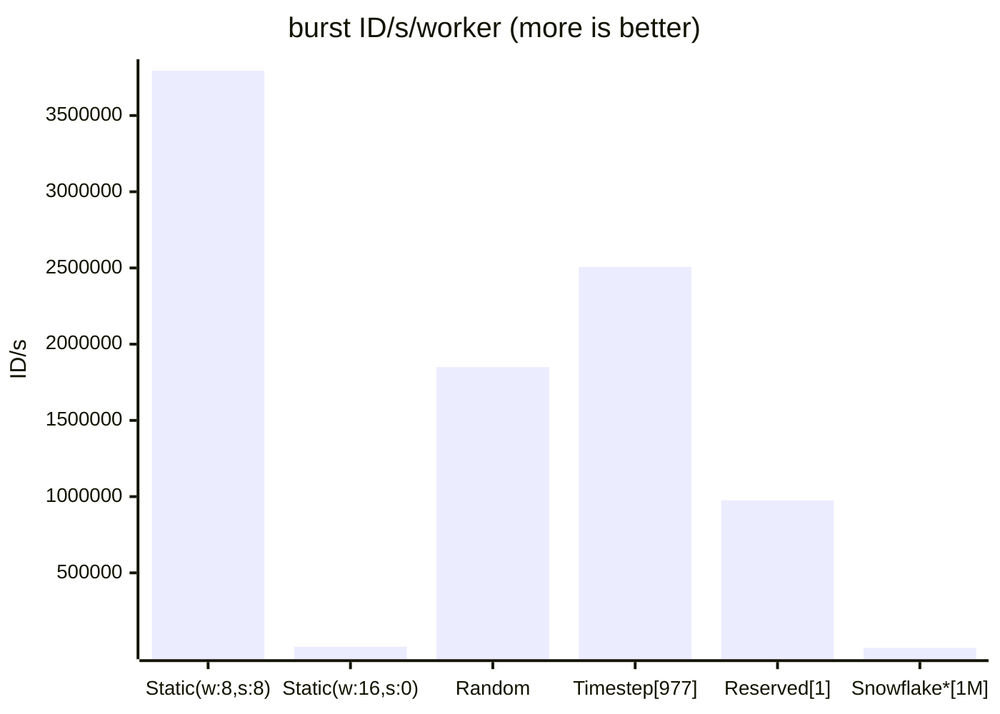

[](https://github.com/pvmlibs/flexid/actions)
[](https://codecov.io/gh/pvmlibs/flexid/branch/master)

# Distributed ID generator for PHP with ID transforming tools

Features:
- Generate unique ID on one or multiple nodes/processes. Workers management included for efficient ID pool usage
- Encode integer ID for shorter strings/obfuscate integer ID with custom alphabet e.g. xzRYLSKxJH
- Encrypt integer ID when need to publish it and want to safely hide the real value
- Sign ID for integrity and authenticity, preventing tampering and enumeration
- ID lifespan ranges from 292 to 292271 years
- up to 1048576 workers
- customizable generators for many different workflows

Transforming tools (encoders, encrypters, signers) can also work with external ID, including ordinary autoincrement ID.
They try to solve common problem with exposing internal ID from database to public. Usually applications use something
like uuidv4/uuidv7/other random id which have impact on performance, memory usage and could also reveal information on id
creation date (uuidv7).
Now we can have performant integer ID in database and transform it to/from application on the fly, without storing
transformed id.

## Requirements

Core functionality doesn't require any extensions and dependencies, required are only:

1. 64-bit system
2. PHP >= 8.1

For worker resolvers:
1. Redis based resolvers require predis composer package or phpredis extension (preferred for performance).
2. APCu based resolvers require apcu extension

For serializing encrypted ID with custom length alphabet:
1. bcmath or gmp extension. You still can serialize encrypted ID without them using power of 2 length alphabet.

For signing:
1. sodium - enables high performance siphash-2-4. Without it, you can use other slower algorithms available in hash
    core extension like sha256.

## Installation

```shell
composer require pvmlibs/flexid
```

## ID structure

ID uses 63 bits (sign bit is not used). There are 4 groups of bits:


ID lifespan range varies from 292 (default) to 292271 years, depending on timestamp bitshift config. Each group bits
count can vary with assumption that the sum of workers, sequence, groups bits and timestamp bitshift value must be <= 30.
Bits configuration and timestamp bitshift directly affects theoretic throughput, timestamp bitshift also defines max ID
lifespan. For more read [ID structure](docs/IdStructure.md)

## Implementation

1. Worker resolver - manages and provide worker id and ID configuration. For more read [Resolvers](docs/Resolvers.md)
   - RedisTimestepWorkerResolver, allows ID uniqueness, needs Redis/Valkey, most universal
   - RedisReservedWorkerResolver, allows ID uniqueness, needs Redis/Valkey, best for long processes
   - StaticWorkerResolver, allows ID uniqueness when provided explicit unique worker ID
   - RandomWorkerResolver, allows ID uniqueness within one process
   - ApcuTimestepWorkerResolver, allows ID uniqueness within group of processes sharing the same APCu
2. Generator - generates ID using resolver. Manages requesting workers and creates sequence with group part.
   Generator should be used as singleton in application for performance and to assure proper time monotonicity. You can
   also define a fallback to other generator if it can't resolve worker id.
3. Encoders - encodes ID to string/decodes from int using provided alphabet. The default alphabet is stripped from common
   vowels to prevent forming random words
   - RotatedAlphabetEncoder - recommended as default, ID are transformed using alphabet and rotation for obfuscation,
                              sequential ID looks random. Produces smallest possible encoded ID.
   - FixedLengthEncoder - ID are transformed to fixed, 16-chars string using provided alphabet.
   - HexEncoder - uses only hexadecimal chars, but it's the fastest from encoders (by 3-6x)
4. Encryptors - encrypts/decrypts ID.
   - Sparx64Encrypter - uses Sparx ARX-based block cipher than can transform ID to other 64-bit number that looks
      completely random and prevents reading back ID without secret key. Encrypted ID have to use serializer for printable
      output
5. Serializers - transforms 64bits of data to string. Exists mainly because of PHP limitation of signed integer type.
     - NativeSerializer - supports only power of 2 alphabet lengths but don't require any php extensions, uses custom
                          alphabet
     - BCMathSerializer - supports custom alphabet lengths and can produce slightly smaller output than NativeSerializer
     - GMPSerializer - same as and interoperable with BCMathSerializer
     - FixedLengthSerializer - produces fixed, 16-chars output using provided custom alphabet
     - HexSerializer - uses only hexadecimal chars, but it's the fastest from serializers (by 2-3x). Fixed length (16).
5. Signers - sign ID using HMAC. It can ensure that ID comes from us and was not changed. Uses serializer for producing
   printable output. Sign is concatenated with ID with or without provided separator. It uses first 64 bits from hashing
   algorithm so max 16 characters for sign, according to used serializer and sign max length setting. Can also use as
   simple crc with e.g. 1-character sign, but then it's not a secure solution. Also, great for preventing ID enumeration.
   There are two versions:
     - Signer - customizable with different serializers and hash algorithms
     - FastSigner - not customizable, hexadecimal output, uses only SipHash-2-4 hash. Faster by 2,5-3x from Signer with
       the fastest serializer (HexSerializer)
   

## Usage

IMPORTANT!
ID handling is part of application design, you need to evaluate what the application requirements are, like:
- how many nodes/processes are expected generate ID concurrently
- what throughput is needed (ID/s/worker)
- can ID be exposed to public? Raw, timestamp based ID don't expose DB records number as implicit as autoincrement ID
  but still they can disclose creation time along with information about worker id, sequence and group id.
  Light form of hiding ID is to use encoder or encrypter for more secure solution. Validate if performance of these
  solutions are acceptable.
- should ID be as short as possible? For that you can use e.g. timestamp bitshift 16 and encoder. Validate with expected
  id throughput.
- how ID will be stored in DB? For DB performance the best is bigint type
- any form of encoding, encrypting and signing ID is practically set in stone if transformed id can come back any time
  in the future, so these settings needs to be set with care 

Parameters that should be constant through application lifetime to prevent ID overlapping:
- timestamp offset
- timestamp bitshift
- encoder parameters (if used) including used alphabet to be able to correctly decode once sent encoded ID
- encrypter parameters (if used) including used alphabet and secret key to be able to correctly decrypt once sent
  encrypted ID
- signer settings

Other parameters like worker bits, sequence bits, group bits are pretty safe to manipulate in future - collision can 
happen only within the same timestep (max 1,07s) when concurrently using different parameters. If you want to
change/have generators with different worker bits and sequence bits working concurrently then set common group bits
and assign each generator type its own group id.  

You can look at [ID overview](docs/IdOverview.md) to get some idea what to expect.

Some general guidance:

1. Use generator as singleton in application for performance and uniqueness guarantee (in StaticWorkerResolver and
   RandomWorkerResolver), unless you want to have generators with different configuration. Encoders, encrypters and
   signers should also be singletons.
2. When sending to JavaScript you need to cast id to string (JS does not handle 64-bit int) or use encoder output.

Generate ID:
```php
// just generate some unique ID
$generator = new \Pvmlibs\FlexId\FlexIdGenerator(
    workerResolver: new \Pvmlibs\FlexId\Resolvers\RedisTimestepWorkerResolver(client: $redisClient)
);

$generator->id(); // 43526598068356096

// static worker id, uses process PID as worker id as example
$generator = new \Pvmlibs\FlexId\(
                workerResolver: new \Pvmlibs\FlexId\Resolvers\StaticWorkerResolver(
                    workerHandlerFn: fn () => getmypid(), workersBits: 8, sequenceBits: 8
                )
            );
$generator->id(); // 43524358613175296
```

Generate many ID more efficiently:
```php
$ids = $generator->bulkIds(1000); // array
```

Generate ID with encoding. Encoders can be also used to encode/decode any integer number (0 - PHP_INT_MAX):

```php
$generator = new \Pvmlibs\FlexId\FlexIdGenerator(
    workerResolver: new \Pvmlibs\FlexId\Resolvers\RedisTimestepWorkerResolver(client: $redisClient)
);
$encoder = new \Pvmlibs\FlexId\Encoders\RotatedAlphabetEncoder();

// using helper container
$encodedId = new \Pvmlibs\FlexId\EncodedId(
   flexIdGenerator: $generator,
   encoder: $encoder,
   // signer: use SignerContract if id should be also signed
);

$id = $encodedId->generateId(); // 43581127276918784
$publicId = $encodedId->toPublicId($id); // sNy4hCLr4V
$encodedId->fromPublicId($publicId); // 43581127276918784

// or use encoder directly
$id = $generator->id(); // 43581127276918784
$publicId = $encoder->encode($id); // sNy4hCLr4V
$encoder->decode($publicId); // 43581127276918784
```

Generate ID with encrypting. Encryptor can be also used to encrypt/decrypt any integer number (0 - PHP_INT_MAX):

```php
$generator = new \Pvmlibs\FlexId\FlexIdGenerator(
    workerResolver: new \Pvmlibs\FlexId\Resolvers\RedisTimestepWorkerResolver(client: $redisClient)
);
$secret = \Pvmlibs\FlexId\Encrypters\Sparx64Encrypter::generateSecret(); // use your own secret
$encrypter = new \Pvmlibs\FlexId\Encrypters\Sparx64Encrypter(
    secret: $secret,
    serializer: new \Pvmlibs\FlexId\Serializers\NativeSerializer()
);

// using helper container
$encryptedId = new \Pvmlibs\FlexId\EncryptedId(
    flexIdGenerator: $generator,
    encrypter: $encrypter,
    // signer: use SignerContract if id should be also signed
);

$id = $encryptedId->generateId(); // 43581127276918784
$publicId = $encryptedId->toPublicId($id); // yVyKqbkQDgYgR
$encryptedId->fromPublicId($publicId); // 43581127276918784

// or use encoder directly
$id = $generator->id(); // 43581127276918784
$publicId = $encrypter->encrypt($id); // yVyKqbkQDgYgR
$encrypter->decrypt($publicId); // 43581127276918784
```

Sign ID directly. Signer can be also used to encrypt/decrypt any ID (as string):

```php
$signer = new \Pvmlibs\FlexId\Signers\Signer(
    serializer: new \Pvmlibs\FlexId\Serializers\NativeSerializer(),
    key: \Pvmlibs\FlexId\Signers\Signer::generateKey(), // use your own key
    hashAlgo: 'siphash-2-4', // default
    separator: '', // without separator
    maxSignLength: 1,
    salt: '', // can add additional salt for hashing id
    );

$id = 'r8BnZxS';
$signed = $signer->getSignedId($id); // r8BnZxSQ
// get id from signed with validation
$id = $signer->getIdFromSigned($signed); // r8BnZxS

// for max security use max sign length. For faster signing use FastSigner.
$signer = new \Pvmlibs\FlexId\Signers\Signer(
    serializer: new \Pvmlibs\FlexId\Serializers\NativeSerializer(),
    key: \Pvmlibs\FlexId\Signers\Signer::generateKey(), // use your own key
    hashAlgo: 'siphash-2-4',
    separator: '-' // when using FixedLengthSerializer or maxSignLength=1 there is no need to use separator
);

$id = 'r8BnZxS';
$signed = $signer->getSignedId($id); // r8BnZxS-DwJgwJWVxfJdx

// other examples of signed id
// encrypted id + full length sign, variable length serializers
// mSG3m1mRjg47.NpBb729yPXt
// encrypted id with variable length serializer + full length sign with fixed length, no separator
// P51GFcjTmJmxPBFFQGxRKdwkwgxQ
// encrypted id + full length sign, fixed length serializers, no separator, always 32 chars
// gMGgRwkPxCDLRkBdCLwDgGDgwRLCPkCd
```

Backfill ID using Unix timestamp in microseconds. Make sure max sequence is enough for given timestep, sort timestamps
ascending or descending to prevent duplicates:
```php
$generator->idInTime(1779275145863184)) // 43585545820962816
```

Check performance, ID distribution in time, throughput with different timestamp bitshift and generator info:
```bash
php vendor/pvmlibs/flexid/src/Scripts/bench.php [--dist --info]
# this is more detailed
php vendor/pvmlibs/flexid/src/Scripts/perf.php
```

You can also use class IdStats passing your configured generator to get results for this configuration.

## Tweaking

All classes are preconfigured, but you may want to tweak some parameters, especially if you have very large application
with very intensive ID generation, then you can make some other optimizations:

1. adjust metadata bits to more reflect your environment characteristics, e.g. need more workers but can use smaller
   sequence or can use fewer workers but need more performance in burst
2. separate generators and resolvers for short threads / long threads with different group id for uniqueness
3. adjust useNewWorkerOnSequenceOverflow. This flag increases ID generation rate when max sequence was reached in given
   timestep (but usually not benefits when below 16 bits of metadata) so we don't need to wait for next timestep at a
   cost of resolving new worker. This may be justified when e.g. only some of the workers will generate this many IDs,
   and it won't pose a threat on workers pool
4. with Redis based resolvers (especially RedisTimestepWorkerResolver), in large rate generation scenario (like > 1k/s
   with distinct generators) you may need to use dedicated database for generators to not affect performance of database
   for application.
5. Use phpredis redis extension instead of predis package for better performance (for Redis based resolvers)
6. Adjust timestampOffset in generator for max ID range - before using in production use and don't change it later. By
   default, it's Unix timestamp for 2025-01-01.
7. Use FlexIdGenerator->bulkIds() when applicable (see method description)
8. Sometimes there is 4x performance difference between php binaries (or Docker images)

## Performance

### ID generation
This implementation provide performance benefits especially when generating lots of IDs. Below are results from 1
generator generating 1M IDs in loop with id() method with different resolvers, 50us Redis round trip was applied.



\* Reference implementation of Snowflake with sequence handled by Redis for uniqueness - so 1 request for each ID.
W and S means workers bits and sequence bits accordingly. If not provided, the resolver defaults are used.
Number in square brackets means number of Redis requests. Timestep resolver by default uses $
useNewWorkerOnSequenceOverflow=true that's why number of Redis requests is much larger than in reserved resolver, but
still much less than in Snowflake implementation.

Keep in mind that performance in burst generation very depends on bit configuration.

### ID transforming tools
From fastest, time for 100 operations - example scenario with transforming integer ID like in pagination results from DB.

Security from the lowest: encoding, encoding + signing, encrypting, encrypting + signing

Encoding:

Encoder                         |                         HexEncoder|                 FixedLengthEncoder|             RotatedAlphabetEncoder|
--------------------------------|-----------------------------------|-----------------------------------|-----------------------------------|
Time [ms]                       |                           0.021891|                           0.094979|                           0.095871|


Encoding + signing ID (FastSigner, SipHash2-4) - fastest 64-bit sign:

Encoder                         |                         HexEncoder|                 FixedLengthEncoder|             RotatedAlphabetEncoder|
--------------------------------|-----------------------------------|-----------------------------------|-----------------------------------|
Time [ms]                       |                           0.047941|                           0.108535|                           0.115809|


Encoding + signing ID (Signer, SipHash2-4, BCMathSerializer) - shortest 64-bit sign:

Encoder                         |                         HexEncoder|                 FixedLengthEncoder|             RotatedAlphabetEncoder|
--------------------------------|-----------------------------------|-----------------------------------|-----------------------------------|
Time [ms]                       |                           0.231167|                           0.270731|                           0.290789|


Encrypting:

Serializer                      |                      HexSerializer|              FixedLengthSerializer|                   NativeSerializer|                   BCMathSerializer|
--------------------------------|-----------------------------------|-----------------------------------|-----------------------------------|-----------------------------------|
Time [ms]                       |                           0.781154|                           0.823523|                           0.822301|                           0.860353|


Encrypting + signing ID (FastSigner, SipHash2-4) - fastest 64-bit sign:

Serializer                      |                      HexSerializer|              FixedLengthSerializer|                   NativeSerializer|                   BCMathSerializer|
--------------------------------|-----------------------------------|-----------------------------------|-----------------------------------|-----------------------------------|
Time [ms]                       |                           0.888096|                            0.86397|                           0.838332|                           0.889979|


Encrypting + signing ID (Signer, SipHash2-4, BCMathSerializer) - shortest 64-bit sign:

Serializer                      |                      HexSerializer|              FixedLengthSerializer|                   NativeSerializer|                   BCMathSerializer|
--------------------------------|-----------------------------------|-----------------------------------|-----------------------------------|-----------------------------------|
Time [ms]                       |                           0.966063|                           1.023381|                           1.004565|                           1.060731|

Even with the most secure solution (encrypt + sign) we can go under 1ms per page with 100 ids. Example outputs from above
transformations are also shown in [ID overview](docs/IdOverview.md).