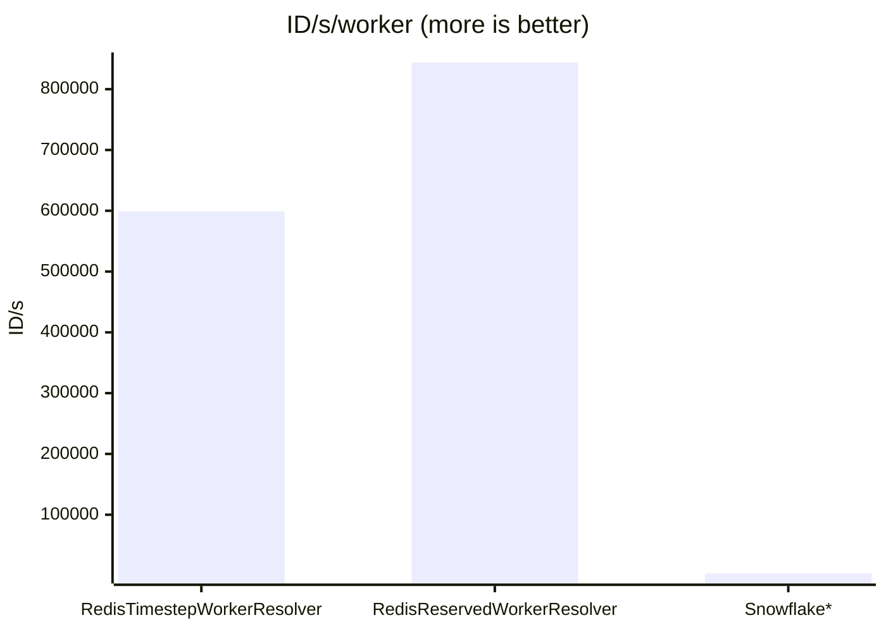

## Benchmarks

For best performance, make sure you don't have loaded debugging or code coverage extensions like xdebug, pcov or make
sure they are turned off. Opcache helps especially with JIT (2x-8x faster), but with JIT can be unstable (mainly SIGSEGV,
depending on php version, application code and hardware - known problem in php).
For signing, use fast hash when possible, e.g. siphash-2-4 (requires sodium extension).

### Unique ID generation with Redis
This implementation provide performance benefits especially when generating lots of IDs. Below are results from 1
generator generating 10k IDs with id() method, 0.2ms Redis round trip was applied to simulate typical cloud latency.

\* Implementation of Snowflake from godruoyi/php-snowflake package with RedisSequenceResolver for uniqueness - 
1 request for each ID. With 1 id generation per request this will flat out as every generator have to ping redis on each id.

### Other tools performance

**PHP 8.5.7, no opcache**

Test with 10k operations:| ops/s
-|-
FlexIdGenerator with StaticWorkerResolver       |  3,861,591
FlexIdGenerator with RandomWorkerResolver       |  1,868,891
BaseSerializer serialize                        |  2,100,734
BaseSerializer deserialize                      |  1,658,946
CustomSerializer (positive int) serialize       |  1,760,244
CustomSerializer (positive int) deserialize     |  1,689,146
CustomSerializer (full range bcmath) serialize  |  1,162,699
CustomSerializer (full range bcmath) deserialize|  1,106,927
CustomSerializer (full range gmp) serialize     |  1,232,817
CustomSerializer (full range gmp) deserialize   |  1,080,921
HashSerializer serialize                        |  1,309,000
HashSerializer deserialize                      |  1,127,885
HexSerializer serialize                         |  7,176,438
HexSerializer deserialize                       |  6,634,186
Base64Serializer serialize                      |  5,348,403
Base64Serializer deserialize                    |  4,428,345
Sparx64Encrypter encrypt                        |  271,522
Sparx64Encrypter decrypt                        |  256,186
AesEncrypter encrypt                            |  303,604
AesEncrypter decrypt                            |  274,772
XChaCha20Encrypter encrypt                      |  651,306
XChaCha20Encrypter decrypt                      |  881,888
Signer (siphash + HexSerializer) sign           |  1,893,738
Signer (siphash + HexSerializer) verify         |  1,641,823
Signer (sha256 + BaseSerializer) sign           |  600,173
Signer (sha256 + BaseSerializer) verify         |  536,371

### Latency test

Testing for low volume operations - 100 operations, including instance creation and preparation overhead. Lowest result
from 3 runs, no opcache, sorted from the lowest time. Added popular php package sqids/sqids for comparison:

operation|time
-|-
HashSerializer serialize                    | 0.051 ms
XChaCha20Encrypter 256-bit key, 128-bit sign  | 0.253 ms
Sparx64Encrypter 128-bit key, 64-bit sign     | 0.765 ms
Sqids v0.5 encode                             | 1.684 ms
AesEncrypter 256-bit key, 64-bit sign         | 1.969 ms

### Opcache influence

Almost all tools scale well with opcache and jit, test with 10k operations:

tool | no opcache, ops/s | opcache + jit function, ops/s
-|-------------------|-
HashSerializer serialize                      | 1,309,000         | 2,602,023
Sparx64Encrypter encrypt                      | 271,522           | 796,851
Sqids v0.5 encode                             | 147,612           | 174,011

